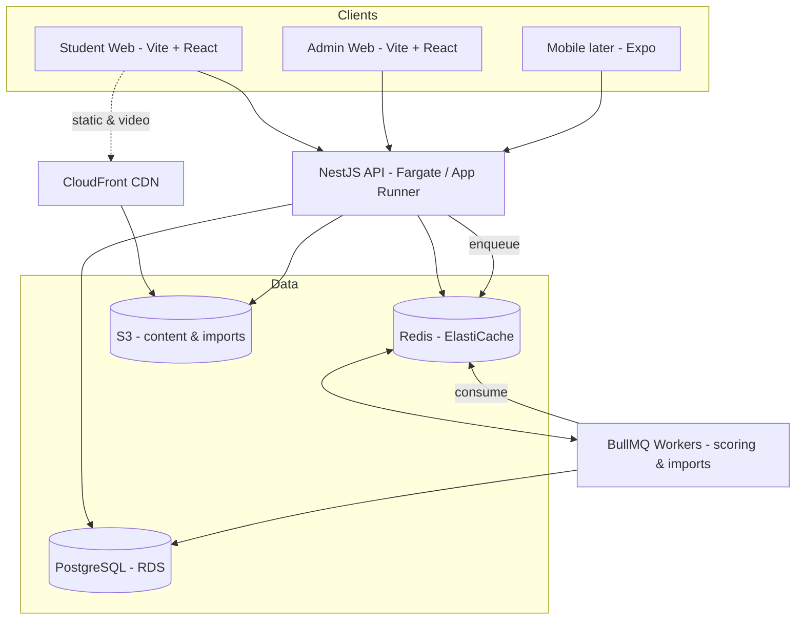

# IACE Learning Platform — V1 Architecture & Build Plan

**Product:** Online mock-test platform for government exam prep (SSC, Banking, RRB JE, SI/Constable)
**Reference / north star:** ThinkExam — copy what works, simplify some, upgrade some, discard the rest
**V1 goal:** A working, bilingual mock-test system sized for **~2K concurrent (must handle 4K; 5K with minor infra additions)** during live timed tests
**Timeline:** 45 days
**Team:** One developer (Harshith) + Claude as co-builder
**Owner:** developer@iace.co.in
**Last updated:** 2026-08-31

---

## 1. How we work together

This is a solo build with Claude as the coding partner, so the whole plan is optimized around **one person's throughput**, not a team's. That drives three rules:

1. **Fewer moving parts beats "best in class."** Every extra service, framework, or clever abstraction is something one person has to learn, debug, and operate at 2 a.m. We pick boring, well-documented, high-DX tools.
2. **Protect the hard-to-change decisions; move fast on the rest.** The data model and the live-test scaling design are expensive to retrofit — we get those right up front. UI, copy, and secondary screens can be iterated freely.
3. **Ship the vertical slice, then widen.** We build one complete path (create a test → student takes it → sees ranked result) end-to-end before polishing any single layer.

Claude handles: scaffolding, boilerplate, schema/migrations, API endpoints, the test-engine logic, infra config, code review, and debugging. Harshith handles: product decisions, exam-domain correctness (marking rules, question content), AWS account/billing actions, and final judgment calls.

---

## 2. Locked tech stack

Everything is **TypeScript, end to end**, in a single monorepo so types are shared between backend and every client.

| Layer                          | Choice                                                                  | Why (for a solo, 45-day build)                                                                                                                                         |
| ------------------------------ | ----------------------------------------------------------------------- | ---------------------------------------------------------------------------------------------------------------------------------------------------------------------- |
| **Monorepo**                   | Turborepo + pnpm workspaces                                             | Share a `types`/`contracts` package across API, web, admin, and (later) mobile. Change an API shape once, every client sees it.                                        |
| **Backend API**                | NestJS (Node + TS)                                                      | One decoupled API serves web now and mobile later. Structure (modules, DI, guards, validation) keeps a solo codebase from turning to mud.                              |
| **Frontend (student + admin)** | Vite + React + TypeScript SPAs                                          | Both apps are SPAs behind login — no SSR needed. One build tool, one mental model for a solo dev.                                                                      |
| **Server data / caching**      | TanStack Query (React Query)                                            | One way to fetch, cache, and invalidate; typed client from `packages/contracts`.                                                                                       |
| **Design system**              | Tailwind CSS + shadcn/ui, tokens in `packages/ui`                       | Single source for color/type/spacing/components — never redefined per component. Brand `#A8221B`, distinct crimson destructive, validated chart palette, light + dark. |
| **Mobile (post-V1)**           | React Native + Expo                                                     | Reuses the same TypeScript, types, and API — mobile is just another client.                                                                                            |
| **Database**                   | PostgreSQL, via **Prisma**                                              | Highly relational (students, tests, questions, attempts). `prisma/schema.prisma` is the source of truth.                                                               |
| **Cache / queue / state**      | Redis + BullMQ                                                          | In-progress test state, live leaderboards, OTP/sessions/devices, rate limiting; scoring + import jobs.                                                                 |
| **Auth**                       | Self-built JWT + refresh; students **mobile-OTP**, admins **email-OTP** | OTP, sessions, and device binding all live in Redis — never the DB.                                                                                                    |
| **SMS / email OTP**            | MSG91 (SMS, DLT) + email provider                                       | Student mobile OTP via MSG91; admin email OTP. Start DLT registration early (lead time).                                                                               |
| **Storage**                    | **S3 via the AWS SDK — every environment**                              | Local dev = MinIO (S3-compatible) in docker-compose; prod = S3 (+ CloudFront later). One upload path, never branched by env.                                           |
| **Realtime**                   | None — no WebSockets                                                    | Client timer + periodic HTTP autosave + Redis is enough.                                                                                                               |
| **Payments**                   | Separate portal — **not in V1**                                         | Handled elsewhere; the platform only reads entitlements later.                                                                                                         |
| **Infra / hosting**            | Decided at the **end**, AWS-leaning                                     | Build cloud-agnostic (Docker + env); everything containerized.                                                                                                         |

**Deliberately deferred** (not in V1, but the schema won't block them): deep per-question time/accuracy analytics, multiple question types beyond single-answer MCQ, Word/PDF question import, native mobile apps, live proctoring.

---

## 3. V1 scope — what "mock tests" means for us

> **Portals:** three — Student (future broad platform), **Test** (this build; test-taking + report, `apps/test`), and Admin. V1 ships the **Test portal + Admin**. Rollout: internal IACE students first, by branch and enrolment; general public later.

### In scope for V1

- **Bilingual/multilingual questions (English + Hindi default)** with a **per-test language display mode**: SINGLE (student picks one language, optional per-question toggle) or DUAL (both languages shown together — stem _and_ options). Defaulted from the base config; SSC CGL defaults to DUAL.
- **Single-answer MCQ** only (schema designed so other types can be added later without migration pain).
- **Images in questions** (figures/tables/diagrams for Reasoning & Quant), supported in both the manual editor and the bulk import.
- **Sign-in**: students sign up with mobile + OTP, then log in with a **4-digit PIN** (OTP resets it); admins use email + OTP. SMS via MSG91.
- **Sectional structure with sectional timing** (IBPS/SBI style), plus an overall test. (Sectional _cutoffs_ and score normalization are deferred to V2.)
- **Negative marking**, configurable per section (e.g. −0.25, −0.5).
- **Question bank** with **bulk import from Excel/CSV** plus a **manual question editor**.
- **Test builder** in the admin panel (base config → auto-draw or manual questions → schedule; timing, marks, negative marking). Series assignment is a separate flow.
- **The live test engine**: client-side timer, server-authoritative start/end, periodic autosave, safe submit under load.
- **Instant results**: score, correct/wrong/unattempted breakdown, **full solutions per question**, and **cohort rank + percentile**.
- **Access control**: Student → Test Series → Test. **There are no groups.** A student reaches a series by an exam match, a program match or an explicit `StudentGrant`, and every one of those is gated by the `BranchTestConfig` row for their branch. Payments live in a **separate portal** — not in V1.
- **Admin panel**: manage questions, tests, series, students, access grants, and view basic operational overview.

### Explicitly out of V1 (planned later)

Deep time-per-question and topic-accuracy analytics; multi-select / numerical / comprehension question types; importing questions from Word/PDF; native mobile apps; proctoring; discussion/community; adaptive practice.

> **Note on a mixed answer:** you selected instant results, rank/percentile, _and_ "just score + solutions" together. Resolution: **V1 ships score + solutions + rank/percentile** (rank is cheap because we already run Redis and it's a real differentiator). **Detailed time/accuracy analytics is deferred to V2**, and the schema is built so it can be added without migrations.

---

## 4. System architecture

The API is stateless, so we can run 1→N identical containers behind a load balancer and scale out under load. All the "hot" per-request state during a live test lives in **Redis**, and durable data lives in **Postgres**. Scoring and bulk imports run off the request path in **BullMQ workers** so a spike of thousands of submissions never blocks the API.

---

## 5. Core data model

**The data model lives in one place: `prisma/schema.prisma` (source of truth), with full feature detail in `docs/02-mocktest-feature-spec.md`.** This section only summarizes the shape so this document stands alone — the schema wins on any conflict.

### The shape (schema is authoritative)

- **Student** and **Admin** are separate tables (student = mobile OTP at signup + 4-digit PIN login; admin = email OTP; OTP/sessions/devices in Redis, not the DB). **StudentProfile** (1:1) holds personal data; the **pre-test gate is minimal** (mother's name + father's name + DOB), full profile optional and gently prompted.
- **Question / QuestionVersion** — `Question` is identity; every edit past the draft inserts an **immutable** `QuestionVersion` carrying content, **options as JSON** (stable option ids so the answer key survives shuffling) and the answer key, then repoints `currentVersionId`. **There is no `QuestionOption` table.** Localized content is JSON per language (text / `$LaTeX$` / S3 image URLs).
- **Subject → Topic** — two levels only. A topic belongs to one subject, the service checks that a question's topic belongs to its subject, and **anything finer is a free-text tag**. There is no SubTopic table.
- **ExamCourse (enum) → Exam → ExamStage → BaseConfig (+ modules, sections)** — the STAGE is what everything hangs off, and a BaseConfig is its blueprint. A **Test inherits** that shape rather than copying it: there is no per-test duration, marks or timing, and the way to change the shape is to clone the config. `languageMode` and the shuffle rules are the CONFIG's. A FIXED test's paper is picked by hand and frozen at finalize; a GENERATED test draws `variantCount` papers at finalize. Per-student order/option shuffle via `Attempt.shuffleSeed`; `PaperQuestion.status` handles drop/bonus.
- **Attempt** holds live state **and** the scored fields (no separate Result table). **AttemptQuestion** stores only interacted questions (composite PK) with the analytics data points.
- **Access** = **Student → TestSeries → Test** by exam match, program match or `StudentGrant`, each gated by the branch's `BranchTestConfig` — a switch with no window. **No groups, and no student↔test link.** A series' `kind` widens the first two paths (`FREE` also reaches an enrolled course, capped; `SCHOLARSHIP` reaches only a grant), and `unlockMode` (`AUTO` / `REQUEST`) plus an optional prerequisite series decide whether a reachable series is OPEN. WHEN a test may be started is the test's own: `TestSeriesTest.unlockAt`, plus `BranchTestSchedule` for late entry and extra time — which blocks STARTING a test, never seeing it. **TestSeries** is optional, flat, many-to-many. **No products, orders, or payments in V1.**

Two choices worth calling out: **localized content as JSON** keeps the bank multilingual with zero migration to add a language, while option identity stays stable (an id + `isCorrect` inside the version) so the answer key survives shuffling; and **access is a series-level grant** — no paywall entity, since payments live in a separate portal.

---

## 6. Live-test scaling design (the make-or-break part)

Thousands of concurrent users (our ~2K normal / 4K required / 5K target) are very achievable on this stack **only if** the mock-test flow is designed to keep Postgres out of the hot path. The naive version — every browser syncing a timer to the server each second and writing every answer straight to the DB — is what melts these platforms. Instead:

**Timer is client-side; server owns the truth.** When a student starts a test, we compute `startedAt` and `endsAt` and store them in **Redis** (and the Attempt row). The countdown _renders_ on the client, but every submit is validated against the server's `endsAt` — no per-second server chatter, and no way to cheat the clock.

**Answers autosave to Redis, not Postgres.** As the student answers, the client autosaves the in-progress answer sheet to Redis every ~20–30 seconds (and on each answer for safety). Redis absorbs this churn effortlessly. Postgres never sees a write until submit.

**Submit is buffered through a queue.** On submit (or auto-submit at time-up), the API writes the final answer sheet, then drops a scoring job onto **BullMQ**. Background **workers** do the evaluation (apply marks + negative marking), compute the score, update the **rank leaderboard in Redis** (a sorted set — O(log n) rank lookups), and write the durable scored fields to Postgres. A spike of thousands of simultaneous submits becomes a queue that drains in seconds, instead of thousands of synchronous DB transactions fighting each other.

**Rank/percentile from Redis sorted sets.** Cohort rank is read from a Redis sorted set per test — instant, and it doesn't touch Postgres on the read path.

**Result:** the API stays stateless and light, Postgres handles a steady trickle of writes instead of a tidal wave, and one small Postgres + one Redis + a couple of API containers comfortably carry the load. We load-test this deliberately before launch.

---

## 7. AWS deployment topology

Kept as simple as possible for someone new to AWS. V1 runs on a handful of managed services:

| Service                                   | Role                                                   | Notes                                                                                                        |
| ----------------------------------------- | ------------------------------------------------------ | ------------------------------------------------------------------------------------------------------------ |
| **App Runner** _or_ **ECS Fargate**       | Runs the API container                                 | Start with App Runner for simplicity; move to Fargate if we need finer control. Auto-scales on CPU/requests. |
| **RDS (PostgreSQL)**                      | Durable data                                           | Single instance for V1. Add a read replica only when reads actually strain it. Automated backups on.         |
| **ElastiCache (Redis)**                   | Test state, queue, leaderboards                        | Single node for V1.                                                                                          |
| **S3**                                    | Question images, content, CSV import files             | Private buckets; presigned URLs for uploads/downloads.                                                       |
| **CloudFront**                            | CDN for static assets, question images & (later) video | Sits in front of S3 and the web apps.                                                                        |
| **Amplify / S3 + CloudFront**             | Hosts student web + admin                              | Frontends on AWS too — one console.                                                                          |
| **Route 53 + ACM**                        | DNS + TLS certificates                                 | HTTPS everywhere.                                                                                            |
| **Secrets Manager / SSM Parameter Store** | DB/Redis/S3/MSG91 secrets                              | No secrets in code or env files committed to git.                                                            |
| **MSG91** (external)                      | OTP + transactional SMS                                | Not AWS, but the India-standard, DLT-compliant choice for OTP login.                                         |

Everything is containerized with Docker so nothing is tied to a single host. Frontends and backend all live in the AWS console for one billing and ops model.

---

## 8. 45-day roadmap

Six phases. Each ends with something demonstrable. Dates are relative to day 1.

**Phase 0 — Foundation (Days 1–5)**
Monorepo (Turborepo + pnpm), NestJS API skeleton, **Vite + React** student & admin app shells wired to the `packages/ui` design system, Prisma against Postgres, Redis + BullMQ, **docker-compose (Postgres + Redis + MinIO)**, and CI. Auth: student **signup mobile-OTP → 4-digit PIN login**; admin **email-OTP** (OTP in Redis) + JWT/refresh, guards. _Milestone: a student signs up by OTP and logs in with a PIN; an admin logs in by email OTP._

**Phase 1 — Question bank (Days 6–13)**
Question + Topic models with **bilingual text and images**. Manual bilingual question editor (with image upload to S3) in admin. Excel/CSV bulk-import pipeline (upload to S3 → BullMQ worker parses & validates → rows land as questions, image references resolved, with an error report). _Milestone: a few hundred real questions — including image-based ones — imported and browsable/editable in admin._

**Phase 2 — Base configs + test builder (Days 14–21)**
Exam-type **base configs** (seed SSC CGL Tier 1), then config-driven test creation: pick a config → **auto-draw** by subject + difficulty % (or manual pick) → schedule. Sectional timing, marks, negative marking, `languageMode`. Status/access/series are separate post-creation actions. (No cutoffs in V1.) _Milestone: a publishable bilingual mock test assembled from the bank exists._

**Phase 3 — Test engine (Days 22–32) — the core**
The student test-taking experience: instructions screen, section navigation, **language display (single or dual)**, question palette (answered/marked/skipped), client timer, Redis autosave, server-authoritative start/end, and safe submit + auto-submit. This is the heaviest phase — budget accordingly. _Milestone: a student can take a full bilingual sectional-timed test start to finish._

**Phase 4 — Results, rank & access (Days 33–40)**
BullMQ scoring workers (marks + negative marking), scored fields on `Attempt`, Score Card + Solution Report, live Redis leaderboard for rank/percentile. Access: series-level reach (exam / program / grant) gated by the branch, plus in-app notification. _Milestone: a student takes an assigned test and sees a ranked result with solutions._

**Phase 5 — Hardening & launch (Days 41–45)**
Load test the live-test path at target concurrency, fix bottlenecks, error monitoring, backups verified, security pass (rate limits, input validation, secrets), basic admin operational dashboard, deploy to production. _Milestone: production launch of V1._

This is achievable but tight; Phase 3 is the risk. If we slip, the first things to trim are admin polish, the generic test UI, and the analytics screen — never the test-engine correctness or the scaling design.

---

## 9. Open decisions & risks

**Resolved:**

- **Frontend:** Vite + React SPAs; Tailwind + shadcn/ui design system in `packages/ui`; TanStack Query. No SSR, no WebSockets.
- **Results scope:** V1 ships score + solutions + rank/percentile; deep analytics deferred (data captured day one).
- **Auth:** student mobile-OTP + admin email-OTP; OTP/sessions/devices in Redis.
- **Media:** images/diagrams in V1 (inline S3 URLs in JSON content); one S3 path via MinIO locally.
- **Payments:** out of V1 (separate portal). Access = series-level, by exam match, program match or a grant, gated by the branch. No groups, no share link.
- **Infra/hosting:** decided at the end, AWS-leaning; build cloud-agnostic.

**Still open (none block starting):**

- Email provider (admin email OTP now; receipts/reminders later) — pick when needed.
- **Start MSG91 + DLT sender-ID registration early** — India SMS approval has real lead time.

**Top risks:**

- **Phase 3 (test engine) overrun** — it's the most complex piece; we protect its timeline by keeping Phases 1–2 lean.
- **Question content readiness** — the platform is only as good as the question bank; importing real, verified bilingual questions needs to start early (Phase 1) and run in parallel.
- **First-time AWS ops** — we mitigate by using the most managed services possible and scripting infra so it's reproducible.

---

## 10. Where the build actually is

**Phases 0–4 are done.** Auth, the question bank and importer, base configs, the test builder, the
live exam engine, BullMQ scoring, the Redis leaderboard, the score card and solution report, and the
student test portal (`apps/test`) all ship. Phase 5 — load test at target concurrency, error
monitoring, backups, security pass, deploy — is what remains.

Built since this plan was written, and not in the roadmap above: the branch
configuration screens, three kinds of test series (`STANDARD` / `FREE` / `SCHOLARSHIP`), unlock
modes and the request queue, prerequisite series, generated paper variants, and exam skins.

1. ✅ Stack, data model, and design system locked; repo initialized with docs, `prisma/schema.prisma`, and `packages/ui` tokens.
2. ✅ Local prerequisites installed: Node 22.13+ (`.nvmrc` pins 22.23.2), pnpm 11, Docker, Git.
3. ✅ Phase 0 scaffolded and every phase through 4 delivered.

Next: Phase 5 — hardening and launch.
