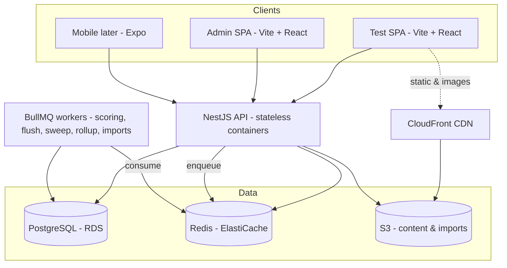

# IACE platform — architecture

What this system is, and why the live test holds at 4–5K concurrent.

The data model is `prisma/schema.prisma` and is not restated here. Module boundaries, table
ownership and the event catalog are `docs/03-conventions.md`. The mock-test feature itself —
render modes, results, the student journey — is `docs/02-domain-rules.md`.

---

## 1. What this is

An online mock-test platform for IACE, a government-exam coaching institute (SSC, Banking, RRB JE,
SI/Constable), replacing ThinkExam. ThinkExam is the reference, not the target: copy what works,
simplify some, upgrade some, discard the rest.

- **Load:** ~2K concurrent normal, must hold 4K, 5K with minor infra additions. Not 10K.
- **Portals:** Test (`apps/test`) — sitting a test and reading the report; Admin (`apps/admin`) —
  everything that builds and runs one; a broad Student portal later.
- **Rollout:** internal IACE students first, by branch and enrolment; public later.

## 2. Locked stack

TypeScript end to end in one monorepo (Turborepo + pnpm workspaces), so an API shape changes once in
`packages/contracts` and every client sees it.

| Layer                     | Choice                                                                           | Why                                                                                                                         |
| ------------------------- | -------------------------------------------------------------------------------- | --------------------------------------------------------------------------------------------------------------------------- |
| **Backend API**           | NestJS                                                                           | One decoupled API serves the SPAs now and mobile later. Modules, DI, guards and validation keep a small team's code honest. |
| **Frontends**             | Vite + React SPAs                                                                | Both apps sit behind login, so there is nothing for SSR to do. No Next.js.                                                  |
| **Server data**           | TanStack Query over the typed client from `packages/contracts`                   | One way to fetch, cache and invalidate.                                                                                     |
| **Design**                | Tailwind + shadcn/ui, tokens in `packages/ui`, light + dark                      | One source for colour, type, spacing and components — never redefined per screen. Charts are Recharts on `--series-*`.      |
| **Client state**          | Zustand, only where React Query does not fit                                     | Server data is not client state; keeping the two apart is what stops cache drift.                                           |
| **Database**              | PostgreSQL via Prisma                                                            | Highly relational. `prisma/schema.prisma` is the target of record.                                                          |
| **Cache / queue / state** | Redis + BullMQ                                                                   | Live sitting state, leaderboards, OTP, sessions, device binding, rate limiting; scoring, flush, sweep and rollup jobs.      |
| **Auth**                  | Self-built JWT + refresh; students mobile-OTP then 4-digit PIN, admins email-OTP | OTP, sessions and device binding live in Redis, never the DB.                                                               |
| **OTP transport**         | `OTP_SENDER` selects console or SMS                                              | India SMS is DLT-registered and the approval has real lead time; the console sender keeps dev off that path.                |
| **Storage**               | S3 SDK in every environment, MinIO locally                                       | Exactly one upload path, never branched by environment.                                                                     |
| **Realtime**              | None — no WebSockets                                                             | A client timer, periodic HTTP autosave and Redis carry the live test. A socket per sitting is the thing that melts.         |
| **Payments**              | Separate portal, not V1                                                          | The platform reads entitlements later; it never owns money.                                                                 |
| **Mobile**                | React Native + Expo, post-V1                                                     | Another client on the same types and the same API.                                                                          |
| **Infra**                 | Docker + env, cloud-agnostic, AWS-leaning                                        | Nothing is tied to one host.                                                                                                |

Deliberately out, and the schema blocks none of them: deep per-question time and accuracy analytics,
question types beyond single-answer MCQ, Word/PDF import, native apps, live proctoring, discussion,
adaptive practice, certificates.

## 3. V1 boundary

- **Bilingual questions**, with a per-test language display mode: `SINGLE` (one language, optional
  per-question toggle) or `DUAL` (both languages, stem _and_ options). It is the base config's.
- **Single-answer MCQ** only; the schema takes other types without a migration.
- **Images in questions**, in both the manual editor and the bulk import.
- **Sign-in:** students sign up with mobile + OTP and then log in with a 4-digit PIN (OTP resets
  it); admins use email + OTP.
- **Sectional structure with sectional timing.** Marks, negative marking, timing and
  merit/qualifying are per section — one paper may mix them.
- **Question bank** with Excel/CSV bulk import plus a manual editor.
- **Test builder:** a base config is the blueprint a test inherits; the paper is hand-picked
  (`FIXED`) or drawn at finalize into variants (`GENERATED`).
- **The live test engine:** client timer, server-authoritative start and end, autosave, safe submit
  under load, one engine behind every `ExamTemplate` skin.
- **Instant results:** score, correct/wrong/unattempted, full solutions per question, and cohort
  rank + percentile.
- **Access:** student → test series → test. There are no groups and no student↔test link. A
  `StudentGrant` overrides every kind and `isEnabled` gates every path, grant included. `FREE`
  reaches everyone, `PROGRAM` matches a program, `EVENT` matches its own candidates; none of the
  three looks at a branch. `STANDARD` is the only branch-gated kind: the series' own `branchIds` (a
  GIN-indexed array) must hold the student's current branch _and_ the stage's exam course must be
  one of their `enrolledCourses`, so a student carrying neither reaches no `STANDARD` series. A
  series is reached or it is not — there is no unlock, no prerequisite, and no queue to ask in.
- **Scheduling belongs to the test:** `Test.opensAt`, `Test.lateEntrySec` (counted from the
  opening), `Test.extraTimeSec`. It blocks _starting_ a test, never seeing one, and `canStart` is
  derived from the clock on every read rather than stored. Series to test is one-to-many:
  `Test.testSeriesId` (required) with `seriesOrder`; there is no join table, no standalone test and
  no standalone sitting.
- **Admin panel:** questions, tests, series, students, branches, grants, and an operational
  overview. Admins are scoped by feature key only — there is no branch scoping on an admin.

## 4. System architecture

The API holds no per-request state, so it runs 1→N identical containers behind a load balancer.
Everything hot during a live test is in Redis; everything durable is in Postgres. Scoring and bulk
imports run off the request path in BullMQ workers, so a spike of thousands of submissions queues
instead of blocking.

## 5. Live-test scaling — the make-or-break

Thousands of concurrent sitters are comfortable on this stack **only** while the mock-test flow
keeps Postgres out of the hot path. The naive build — every browser syncing a timer each second and
every answer written straight to the DB — is what melts these platforms. Instead:

**The timer is client-side; the server owns the truth.** Starting a test computes `startedAt` and
`endsAt`, which the server owns. The countdown _renders_ on the client, but every save and every
submit is validated against the server's `endsAt`. No per-second chatter, and no way to cheat the
clock.

**Answers autosave to Redis, never Postgres.** The client flushes the in-progress answer sheet every
20–30 seconds. Redis absorbs that churn; Postgres is never written per keystroke. The live sitting
lives in Redis and the key existing is what "this sitting is open" means, so a save arriving after a
submit finds no key and is refused. A background job copies Redis to the durable rows on a timer, so
a failed run costs the copy a minute, not the answers.

**Submit is buffered through a queue.** On submit — or auto-submit at time-up — the scoring request
is inserted in the same transaction that flips the sitting to `SUBMITTED`, so no crash can strand an
attempt nobody scores. Handing it to BullMQ is a separate, repeatable step, deduplicated by job id.
The worker evaluates (marks and negative marks), updates the Redis leaderboard, and writes the
durable scored fields. Thousands of simultaneous submits become a queue that drains in seconds
instead of thousands of synchronous transactions fighting each other.

**Rank and percentile are read live from Redis.** One sorted set per test: `ZADD` on score,
`ZREVRANK` for position, O(log n), and never a Postgres read on that path. **There is no regenerate
step** — no batch that rebuilds results, and no state where a rank is stale until someone runs it.

The result: a stateless API, Postgres taking a trickle of writes instead of a tidal wave, and one
small Postgres plus one Redis plus a few API containers carrying the load.

## 6. Deployment topology

A handful of managed services, containerised so nothing is tied to a single host.

| Service                      | Role                                      | Notes                                                                  |
| ---------------------------- | ----------------------------------------- | ---------------------------------------------------------------------- |
| App Runner _or_ ECS Fargate  | Runs the API container                    | App Runner first for simplicity; Fargate when finer control is needed. |
| RDS (PostgreSQL)             | Durable data                              | Single instance. A read replica only when reads actually strain it.    |
| ElastiCache (Redis)          | Live sitting state, queues, leaderboards  | Single node. Losing it loses in-flight sittings, not scored results.   |
| S3                           | Question images, content, import files    | Private buckets, presigned URLs. Same SDK path as MinIO locally.       |
| CloudFront                   | CDN for static assets and question images | In front of S3 and the SPAs.                                           |
| Amplify _or_ S3 + CloudFront | Hosts the Test and Admin SPAs             | Static builds; no server rendering to host.                            |
| Route 53 + ACM               | DNS and TLS                               | HTTPS everywhere.                                                      |
| Secrets Manager / SSM        | DB, Redis, S3 and SMS credentials         | No secrets in code or in a committed env file — `.env.example` only.   |
| SMS provider (external)      | OTP and transactional SMS                 | DLT-compliant, which is what India requires for OTP login.             |
