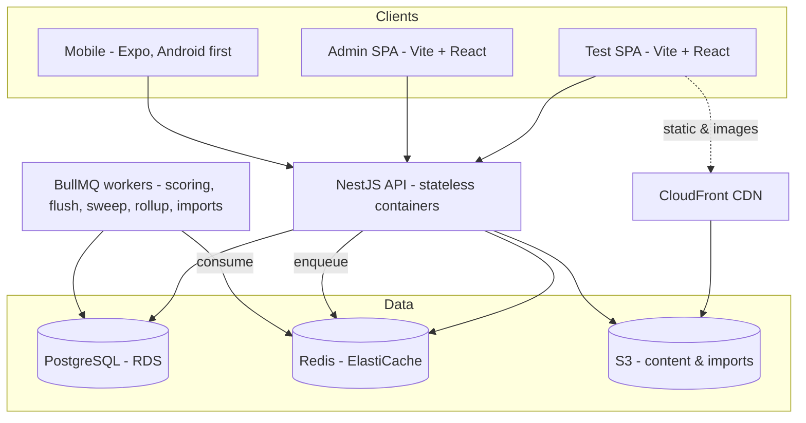

# IACE platform — architecture

What this system is, and why the live test holds at 6–8K concurrent.

The data model is `prisma/schema.prisma` and is not restated here. Module boundaries, table
ownership and the event catalog are `docs/03-conventions.md`. The mock-test feature itself —
render modes, results, the student journey — is `docs/02-domain-rules.md`.

---

## 1. What this is

An online mock-test platform for IACE, a government-exam coaching institute (SSC, Banking, RRB JE,
SI/Constable), replacing ThinkExam. ThinkExam is the reference, not the target: copy what works,
simplify some, upgrade some, discard the rest.

- **Load:** ~3K concurrent normal, must hold 6K, 8K with minor infra additions, and 10K
  within the same infra limits.
- **Portals:** Test (`apps/test`) — sitting a test and reading the report; Admin (`apps/admin`) —
  everything that builds and runs one; Mobile (`apps/mobile`) — the student side on Android, in
  progress; a broad Student portal later.
- **Rollout:** internal IACE students first, by branch and enrolment; public later.

## 2. Locked stack

TypeScript end to end in one monorepo (Turborepo + pnpm workspaces), so an API shape changes once in
`packages/contracts` and every client sees it.

| Layer                     | Choice                                                                           | Why                                                                                                                        |
| ------------------------- | -------------------------------------------------------------------------------- | -------------------------------------------------------------------------------------------------------------------------- |
| **Backend API**           | NestJS                                                                           | One decoupled API serves both SPAs and the mobile app. Modules, DI, guards and validation keep a small team's code honest. |
| **Frontends**             | Vite + React SPAs                                                                | Both apps sit behind login, so there is nothing for SSR to do. No Next.js.                                                 |
| **Server data**           | TanStack Query over the typed client from `packages/contracts`                   | One way to fetch, cache and invalidate.                                                                                    |
| **Design**                | Tailwind + shadcn/ui, tokens in `packages/ui`, light + dark                      | One source for colour, type, spacing and components — never redefined per screen. Charts are Recharts on `--series-*`.     |
| **Client state**          | Zustand, only where React Query does not fit                                     | Server data is not client state; keeping the two apart is what stops cache drift.                                          |
| **Database**              | PostgreSQL via Prisma                                                            | Highly relational. `prisma/schema.prisma` is the target of record.                                                         |
| **Cache / queue / state** | Redis + BullMQ                                                                   | Live sitting state, OTP, sessions, rate limiting; scoring, flush, sweep and rollup jobs.                                   |
| **Auth**                  | Self-built JWT + refresh; students mobile-OTP then 4-digit PIN, admins email-OTP | OTP and sessions live in Redis, never the DB.                                                                              |
| **Outbound messaging**    | SMS for OTP and the roster PIN; everything else in-app, web push and FCM         | Those two are what somebody is WAITING on. The rest cost nothing to deliver, so no other kind buys a paid message.         |
| **OTP transport**         | `OTP_SENDER` selects console or SMS                                              | India SMS is DLT-registered and the approval has real lead time; the console sender keeps dev off that path.               |
| **WhatsApp**              | Interakt only, wired and off — future scope                                      | One vendor, not a switch between two. An empty key leaves the channel unrouted; turning it on is env plus a restart.       |
| **Storage**               | S3 SDK in every environment, MinIO locally                                       | Exactly one upload path, never branched by environment.                                                                    |
| **Realtime**              | None — no WebSockets                                                             | A client timer, periodic HTTP autosave and Redis carry the live test. A socket per sitting is the thing that melts.        |
| **Payments**              | Separate portal, not V1                                                          | The platform reads entitlements later; it never owns money.                                                                |
| **Mobile**                | React Native + Expo in `apps/mobile`, Android first, in progress                 | Another client on the same types and the same API. Sign-in through sitting a test is built; nothing has shipped.           |
| **Infra**                 | Docker + env, cloud-agnostic, AWS-leaning                                        | Nothing is tied to one host.                                                                                               |

Deliberately out, and the schema blocks none of them: deep per-question time and accuracy analytics,
question types beyond single-answer MCQ, Word/PDF import, live proctoring, discussion, adaptive
practice, certificates.

**A student holds one web session and one mobile session.**

- **The rule:** every request says which app sent it (`x-client: WEB|MOBILE`, plus
  `x-device-name`). A new student sign-in revokes that student's sessions of the same kind, and any
  from before kinds were recorded; the other kind stays. Admins are not limited.
- **The replaced device:** a replaced session leaves a Redis tombstone for the refresh lifetime, so
  that device is refused with `SESSION_REPLACED` and its sign-in screen says why. It is read only
  once a session is already missing, so a request that succeeds pays nothing.
- **Active devices:** both Account screens list the account's sessions and sign another one out
  (`/me/sessions`). "Last active" moves on refresh, never per request.

**The mobile client** holds four decisions the code cannot state on its own:

- **A question is drawn in one persistent WebView.** Stems and options are authored HTML with KaTeX,
  tables and Indic script, and `richHtml` needs a DOM, so the page runs a bundled copy of the web's
  own `richHtml` and stylesheets and is swapped, not remounted, between questions. It is a view: the
  answer, the clock and autosave stay native, and a message the page posts is refused unless it is
  well formed and names something the question on screen lets a student do.
- **The Android navigation guard fails open.** `react-native-webview` lets a navigation through when
  JS has not answered within 250ms, so `onShouldStartLoadWithRequest` is a backstop. The defences
  are `richHtml`'s tag whitelist, which lets no link through, and a CSP whose only script source is
  the page script's own hash.
- **`apps/mobile/turbo.json` exists because the page is reached by path.** The WebView page imports
  `packages/ui` source by relative path, not as a workspace dependency, so turbo cannot see the
  edge; the file adds `packages/ui/src` to the build and typecheck inputs so a change there rebuilds
  the page instead of hitting the cache.
- **Unsent answers are kept on the phone, in `expo-sqlite`'s key-value store, not SecureStore.** The
  queue is neither a secret nor small, and the engine writes it synchronously after every answer, so
  the last answer before the app dies is still there on relaunch. The same store holds the device's
  tab id, minted once per install, so an app relaunch keeps the sitting the way a web reload does.

## 3. V1 boundary

- **Bilingual questions**, with a per-test language display mode: `SINGLE` (one language, optional
  per-question toggle) or `DUAL` (both languages, stem _and_ options). It is the base config's.
- **Single-answer MCQ** only; the schema takes other types without a migration.
- **Images in questions**, in both the manual editor and the bulk import.
- **Sign-in:** students sign up with mobile + OTP and then log in with a 4-digit PIN (OTP resets
  it); admins use email + OTP.
- **Sectional structure with sectional timing.** Marks, negative marking, timing and
  merit/qualifying are per section — one paper may mix them.
- **Question bank** with Excel/CSV bulk import plus a manual editor.
- **Test builder:** a base config is the blueprint a test inherits; each test is one paper, picked
  by hand, and a section can be filled from its own spec.
- **The live test engine:** client timer, server-authoritative start and end, autosave, safe submit
  under load, one engine behind every `ExamTemplate` skin.
- **Instant results:** score, correct/wrong/unattempted, full solutions per question, and cohort
  rank + percentile.
- **Access:** student → test series → test. There are no groups and no student↔test link. A
  `StudentGrant` overrides every kind and `isEnabled` gates every path, grant included. `FREE`
  reaches everyone, `PROGRAM` matches a program, `EVENT` matches its own candidates; none of the
  three looks at a branch. `STANDARD` is the only branch-gated kind: the series' own `branchIds` (a
  GIN-indexed array) must hold the student's current branch _and_ the stage's exam course must be
  one of their `enrolledCourses`, so a student carrying neither reaches no `STANDARD` series. A
  series is reached or it is not — there is no unlock, no prerequisite, and no queue to ask in.
- **Scheduling belongs to the test:** `Test.opensAt`, and optionally an earlier opening per program
  (`TestProgramUnlock`); nothing shuts a test once it opens. It blocks _starting_ a test, never
  seeing one, and `canStart` is derived from the clock on every read rather than stored. Series to
  test is one-to-many: `Test.testSeriesId` (required) with `seriesOrder`; there is no join table, no
  standalone test and no standalone sitting.
- **Admin panel:** questions, tests, series, students, branches, grants, and an operational
  overview. Admins are scoped by feature key only — there is no branch scoping on an admin.

## 4. System architecture

The API holds no per-request state, so it runs 1→N identical containers behind a load balancer.
Everything hot during a live test is in Redis; everything durable is in Postgres. Scoring and bulk
imports run off the request path in BullMQ workers, so a spike of thousands of submissions queues
instead of blocking.

## 5. Live-test scaling — the make-or-break

Thousands of concurrent sitters are comfortable on this stack **only** while the mock-test flow
keeps Postgres out of the hot path. The naive build — every browser syncing a timer each second and
every answer written straight to the DB — is what melts these platforms. Instead:

**The timer is client-side; the server owns the truth.** Starting a test computes `startedAt` and
`endsAt`, which the server owns. The countdown _renders_ on the client, but every save and every
submit is validated against the server's `endsAt`. No per-second chatter, and no way to cheat the
clock.

**Answers autosave to Redis, never Postgres.** The client flushes the in-progress answer sheet every
20–30 seconds. Redis absorbs that churn; Postgres is never written per keystroke. The live sitting
lives in Redis and the key existing is what "this sitting is open" means, so a save arriving after a
submit finds no key and is refused. A background job patches what changed into the sitting's one
answer sheet on a timer, so a failed run costs the copy a minute, not the answers.

**Every write of the live key is a compare-and-swap.** A save, a resume that hands the sitting to
another tab or device, and a rebuild of a lost key each read the key's bytes and write through one
Lua script that lands only on those same bytes, retrying a few times before refusing with
`CONFLICT`. Two devices writing one sitting can then never lose an acknowledged answer or put back
a tab that was just stood down. An uncontended save is still three Redis round trips (GET, EVAL,
SADD), and Postgres stays off the path.

**A client that cannot reach the server keeps its answers and asks again, boundedly.** Answers a
save could not deliver are queued on the client (the tab's `sessionStorage` on the web, the phone's
own store on mobile) and re-sent on the next save or after a reload. A submit is retried only when
the request never reached the server, at most three times at 1s, 2s and 4s, inside the server's 30s
grace after `endsAt`; a refusal or a server error that did land is never retried, and the countdown
fires expiry once, so a whole hall hitting zero together cannot become a retry storm.

**Submit is buffered through a queue.** On submit — or auto-submit at time-up — the scoring request
is inserted in the same transaction that flips the sitting to `SUBMITTED`, so no crash can strand an
attempt nobody scores. Handing it to BullMQ is a separate, repeatable step, deduplicated by job id.
The worker evaluates (marks and negative marks) and writes the durable scored fields, the time the
sitting took among them. Thousands of simultaneous submits become a queue instead of thousands of
synchronous transactions fighting each other — nobody waits on it, but it is not instant: `docs/04`
§3 measures the drain at a minute or two for a full hall, and that is the figure to watch on the
day.

**Rank and percentile are counted live from Postgres.** A test's cohort is its graded, evaluated,
scored sittings, ordered by marks, then time taken, then id. The partial index `Attempt_ranking_idx`
serves a sitting's standing, an index-only count per sitting, and "N sat": on 200 tests of 5,000
sittings, counting 20 of them is an index-only scan of about 8 ms, while a table holding only the
tests asked is read whole. A test board reads its cohort through `Attempt_testId_status_idx`. The
points boards have no index of their own — they scan every graded sitting in scope, which is why
they are the first reads to cross a budget: `Attempt_testId_score_idx` was dropped as redundant
against `Attempt_ranking_idx`, costing 6.5 MB per 105K sittings and an entry in every non-HOT
update. A rank is counted each time it is read and saved nowhere, so it is always the standing now,
and no count sits on the path that starts, saves or submits a sitting. **There is no regenerate step** — no batch that rebuilds results, and no
state where a rank is stale until someone runs it.

**What the counts cost, and what to do when a board outgrows its budget.** On 20 tests of 5,000
graded sittings each: a standing 1.5 ms, a test board 5.7 ms, "N sat" 10.8 ms, a student with 50
sittings 13.1 ms, the series board 128 ms against a budget of 150, and the all-time board 129 ms
against 300. The points boards scan every graded sitting in their scope on each read and grow about
1.3 ms per 1,000, so a series of ~40 full mocks crosses its budget first. When a board crosses,
cache its ranked list per scope for 60 seconds, slice the podium and each reader's neighbourhood
from it in Node, and count the reader's prior rank against that same cached list. Not a cache per
reader: that still pays the full scan once for every student who opens the board.

The result: a stateless API, Postgres taking a trickle of writes instead of a tidal wave, and one
small Postgres plus one Redis plus a few API containers carrying the load.

## 6. Deployment topology

A handful of managed services, containerised so nothing is tied to a single host. Sizes, costs and
the release runbook are `docs/04-infrastructure.md`; this table is what each piece is for.

| Service                 | Role                                      | Notes                                                                                            |
| ----------------------- | ----------------------------------------- | ------------------------------------------------------------------------------------------------ |
| EC2 (ARM) + Docker      | Runs the API containers                   | Three from one image, chosen by `API_ROLE`: exam, core, and exactly one worker.                  |
| Caddy                   | TLS and path routing to the API           | On the same box. Not an ALB — see `04` §4 for what that gives up.                                |
| RDS (PostgreSQL)        | Durable data                              | Single instance. A read replica only when reads actually strain it.                              |
| Valkey on EC2           | Live sitting state, queues, sessions      | One node, saving to disk. Losing it loses in-flight sittings, not scored ones.                   |
| S3                      | Question images, content, import files    | Private bucket. Content images are read on a stable CDN url, private files presigned (`04` §10). |
| CloudFront              | CDN for static assets and question images | In front of S3 and the SPAs.                                                                     |
| S3 + CloudFront         | Hosts the Test and Admin SPAs             | Static builds; no server rendering to host.                                                      |
| Route 53                | DNS                                       | Caddy gets the API's certificate itself; CloudFront brings its own.                              |
| SSM Parameter Store     | DB, Valkey and SMS credentials            | No secrets in code or in a committed env file — `.env.example` only. S3 uses the task role.      |
| SMS provider (external) | OTP and the roster PIN, and nothing else  | DLT-compliant, which is what India requires for OTP login.                                       |
| Web push (external)     | Every other message to a browser          | VAPID direct to the browser's push service. No vendor and no per-message cost.                   |
| FCM (external)          | The same message to a signed-in phone     | A service account, HTTP v1. Android only until the Firebase iOS SDK is added.                    |

**Anything in front of the API must pass `x-client` and `x-device-name` through.** A load balancer or
CDN that strips them makes every sign-in kind-less, so each new sign-in replaces all of a student's
other sessions: one session in total, not one web plus one mobile.

**Deploying the ranking change.** Migration `20260911190000` holds ACCESS EXCLUSIVE on `Attempt`
through its backfill and its index build, so run it outside a live test window. Code from before
`db64efc` fails against the columns `20260911220000` drops, so stop the API and the workers,
migrate, then start the new code. A sitting an old worker scores after `20260911220000`'s refill
keeps a NULL time and ranks as the slowest, so stop the workers first or re-run that refill. Run
`VACUUM (ANALYZE) "Attempt"` after the backfill. A Test SPA tab loaded before the deploy cannot
start a test until it is reloaded, because its live-attempt schema still requires `lastRank` and
`lastPercentile`.
